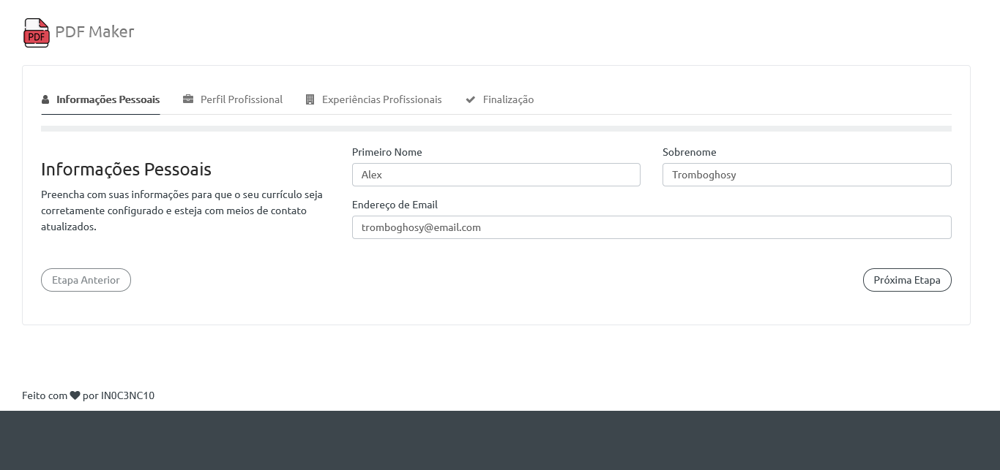
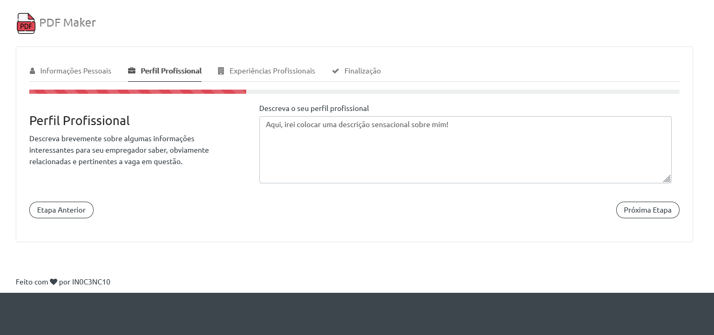
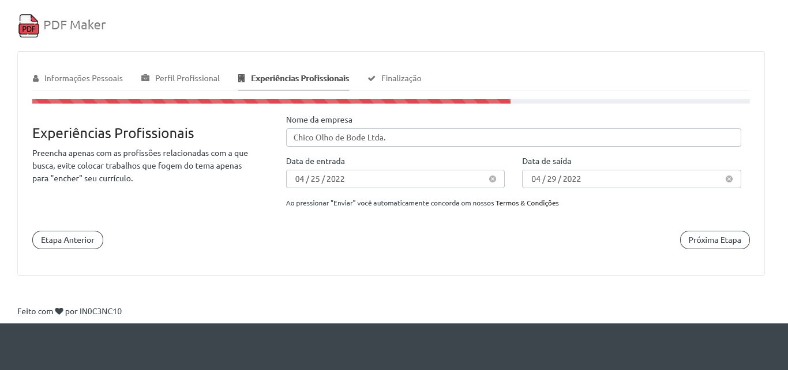
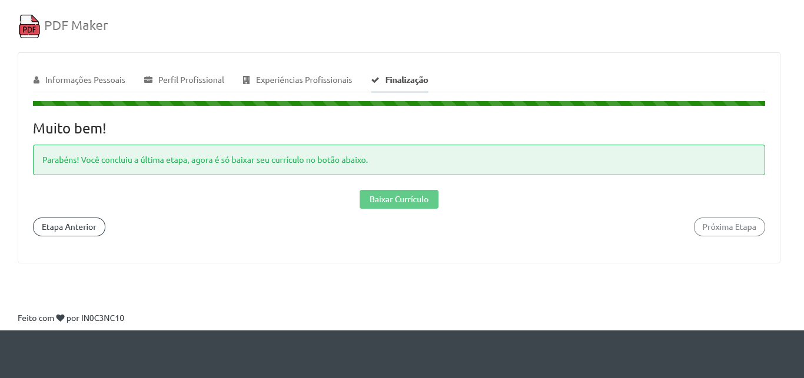
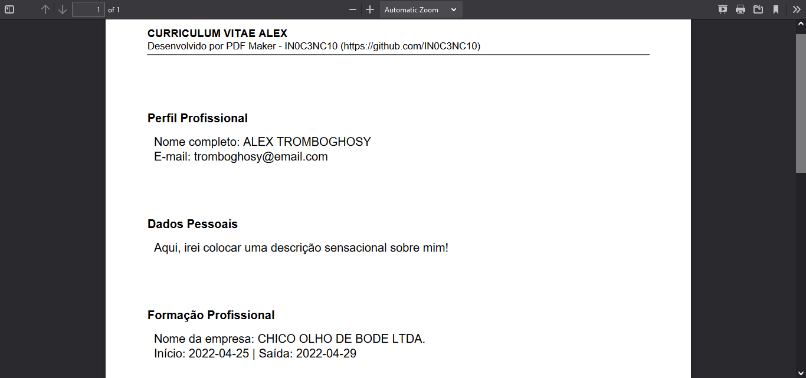

<h1 align="center" id="title">PDF Maker</h1>
<!-- Logo -->
<p align="center">
  
</p>


<!-- Título&Descrição -->
<h2 align="left" id="descricao">Descrição</h2>
<p align="justify">
  Este é um website simples, feito com fins de estudo e aprendizado em API, Vue.js e Node.js, cadastra tarefas, as lista com filtros, destaca as atrasadas e tudo isso gerenciado por meio do Mac Address informado.
</p>


<!-- Shields -->
<p>
	</img>
  </img>
  <!--</img>-->
  </img>
</p>


<!-- Screenshots -->
<h2 align="left" id="screenshots">Screenshots</h2>
<p align="center">
  
  
  
  
  
</p>


<!-- Pré-Requisitos -->
<h2 align="left" id="pre">Pré-Requisitos</h2>

Antes de iniciarmos, você vai precisar ter instalado em sua máquina as seguintes ferramentas:

- [PHP](https://www.php.net/downloads)
- [XAMPP](https://www.apachefriends.org/pt_br/index.html)

Também facilita muito você possuir um editor para trabalhar com o código, fica a dica o [VSCode](https://code.visualstudio.com/).


<!-- Features -->
<h2 align="left" id="features">Conteúdos</h2>

- [x] Cadastro de todo histórico pessoal e/ou profissional;
- [x] Geração de currículos em formato .PDF;


<!-- Executando o app -->
<h2 align="left" id="run">Rodando o website</h2>

```bash
# Clone este repositório
$ git clone https://github.com/IN0C3NC10/PDF-Maker.git

# Inicie o seu servidor local (XAMPP/WampServer)

# Copie a pasta deste projeto para a home do servidor (XAMPP>htdocs)

# Abra o projeto (no navegador) na porta especificada pelo servidor e pronto

# Show, agora precisaremos gerar o arquivo config.ini, você pode fazer manualmente pegando o "config_example.ini"

# Ou utilizar o arquivo "build_ini_file.php" para fazer tudo para você
#   É só colocar o nome deste arquivo após o endereço no seu navegador e "BANG", o arquivo é criado

#LetsCoding!
```
<!-- Autor -->
<h2 align="left" id="autor">Autor</h2>
<p>
	<a href="https://github.com/IN0C3NC10">
		
	</a>
	<br />
	Feito com ❤️ por <strong>Bruno Inocencio</strong>!
</p>

<p align="left">
  <!-- Outlook -->
  <a href="mailto:bruno.inocencio@fatec.sp.gov.br" alt="Outlook" target="_blank">
    
  </a>
  <!-- Linkedin -->
  <a href="https://cutt.ly/nQlVjQV" alt="Linkedin" target="_blank">
    
  </a>
  <!-- GitHub -->
  <a href="https://github.com/IN0C3NC10" alt="GitHub" target="_blank">
    
  </a>
</p>
